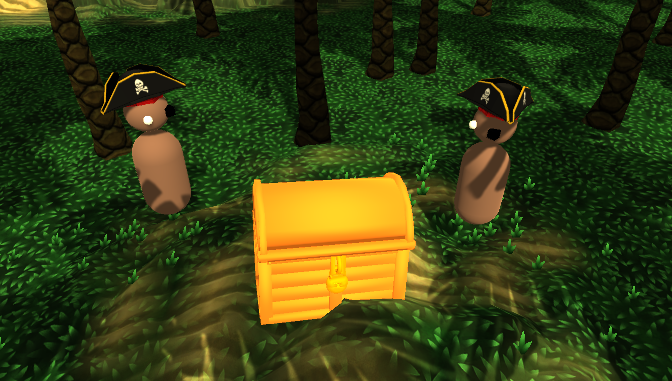
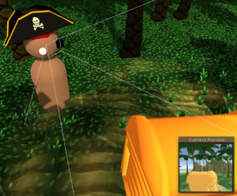
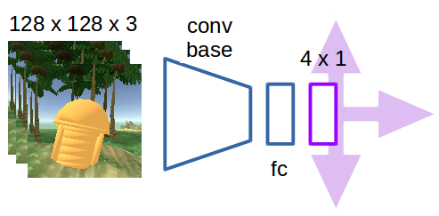
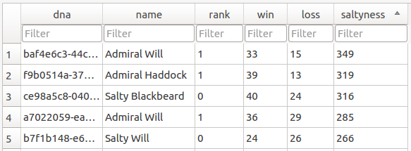
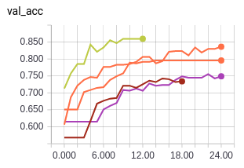
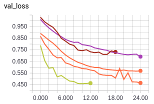
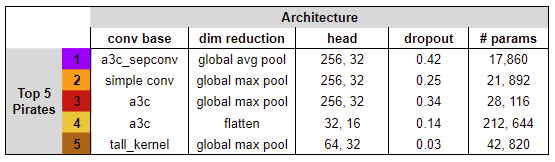
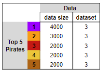
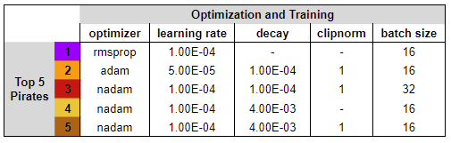

# PirateAI

PirateAI is a personal project that trains autonomous agents (pirates) in a simulated environment (island).
This repo runs a training pipeline that alternates between a game (find the treasure) and model training 
sessions (Keras + hyperopt).

[YouTube Video](https://youtu.be/P3grJ5LHb8k)

## Environment

The agents in this island are pirates. Pirates are marooned (randomly spawned) within the island 
in pairs (pirate vs pirate). The goal of each pirate when marooned is to find the treasure (walk up and touch it), 
after which the game will end. Winning pirates rise in the ranks within their Ship, and slowly but surely the best 
pirates bubble to the top.

The Ship is a local sqlite database that holds pirates. It keeps track of wins, losses, ranking, randomly generated 
pirate names, etc. Each pirate has a specific uuid4 string called its dna, which is used to connect it with saved 
models, logs, and database entries.

Pirates have a camera in the center of their head that records 128 x 128 x 3 images. These images are used as input
for the pirate models, which will output an instantaneous action for a given image. Data sets of image and action 
pairs are created using a heuristic or through a human player.

The island environment is created using [Unity](https://unity3d.com/), a popular game-development engine, and Google 
[Poly](https://poly.google.com/). In particular, I use [Unity ML Agents](https://github.com/Unity-Technologies/ml-agents)
to interface and communicate with the unity environment. Note I use a custom [fork](https://github.com/HugoCMU/ml-agents),
 which I do not keep up to date with the latest repo.

## Learning

Pirates make decisions by evaluating inputs with deep learning models. I focus on smaller, 
simpler models since my GPU resources are limited.

 Some models are custom, and some are loosely based on things I read in papers. For example the _ff_a3c_ model is 
inspired by the encoder in _Learning to Navigate Complex Environments_. I also include larger pre-trained model bases
 such as _Xception_ and _Resnet50_.

The model architechture is just one of many different possible hyperparameters when it comes to training 
a model. Others include optimizer, learning rate, batch size, number of fc layers, batchnorm, etc. The space of 
possible hyperparameters is huge, and searching it is expensive. To best utilize the low GPU resources 
available, pirateAI uses a two-part training process:

***Step 1*** Make use of [hyperopt](https://github.com/hyperopt/hyperopt) to train a series models while searching 
through 
the hyperparameter space. I use validation loss (cross entropy between the true label and predicted label for an input image)
 as the optimization metric for the hyperopt training sessions. Graduate the best models (lowest validation loss) to 
 full pirates, and add them to the ship (db).
 
***Step 2*** Select two pirates from the ship and maroon them on the island. This starts a marooning game, where the 
first 
pirate to get to the tresure wins. Pirates accumulate saltyness (rating system) every win, and the pirates with the 
lowest saltyness are permanently removed from the ship. Running models in inference is quicker than training and 
environment performance is a better validation metric than validation loss.
 
By alternating between training models and evaluating them in a competitive game within the environment, you can 
quickly arrive at good performing model and set of hyperparameters.

## Results

For the final experiment, all the models had relatively low capacity (weights) and only a limited amount of training 
data. A true test of resourcefulness. The results here are from running the pirateAI loop for 12 hours. Looking into 
our ship database we get the following top 5 pirates (lots of Wills apparently):

The associated Tensorboard plots for validation accuracy and validation loss. The shortness of the lines is due to 
aggressive early stopping (to further speed up the training process). From the plots, we can see that the 
metrics are fairly spread out, confirming our intuition that validation loss & accuracy are inappropriate for 
judging final agent performance.

***Architecture***

The hyperparameter space for model architechture boiled down to:

    - 5 different convolution bases.
    
    - 3 different dimensionality reduction choices. This is the part of the model that takes the 3D tensors coming 
    out of the conv block and reduces it to a 2D tensor which we can feed to the model head.
    
    - 6 different head choices (with and without dropout whose percentage also varied). These are the fully connected 
    layers right before the final output layer of the net.
    
You can look up the exact makeup of the layers for the model parts above in [`model_chunks.py`](src/model_chunks.py).
 It seemed 
like the _256, 32_ head (256x1 fully connected layer followed by a 32x1 fc layer) was the most popular. Due to the 
black box 
nature of deep learning, its hard to give a reason other than _it seems best for this problem_.

The interesting result for me is that the number of parameters, or model capacity, did not seem to be important when 
determining agent performance. In fact, the top pirate actually had the _least_ capacity.

***Dataset***

The first thing to talk about is the size of the training data. We see large variability here in the top 5. To me 
this suggests that for the given problem of finding a treasure, you don't actually need that much data. Having more 
data thus doesn't really help you.

Another hyperparameter tested on the dataset was the composition of each data set. There were four dataset _flavors_ 
available for training, these were:
    
    1. Noisy data (some wrong actions) with a bias towards moving forward (W action)
    2. Noisy data with a balanced distribution of actions
    3. Clean data with a bias towards moving forward
    4. Clean data with a balanced distribution of actions

Every single one of the top 5 models was trained using dataset 3 above. Clean data being better than noisy data makes 
sense, since there will be less examples that push the gradient in the wrong direction. As for why the forward bias 
matters, my speculation is that pirates that move forward slightly more often get to the treasure slightly quicker.

***Optimization***

There were a couple different hyperparameters related to optimization and training that were tested. The results  
here were the least interesting, with lots of variability in the top 5. This makes sense intuitively, as the best
 optimization parameters will be dependent on the model architechture and dataset. 

